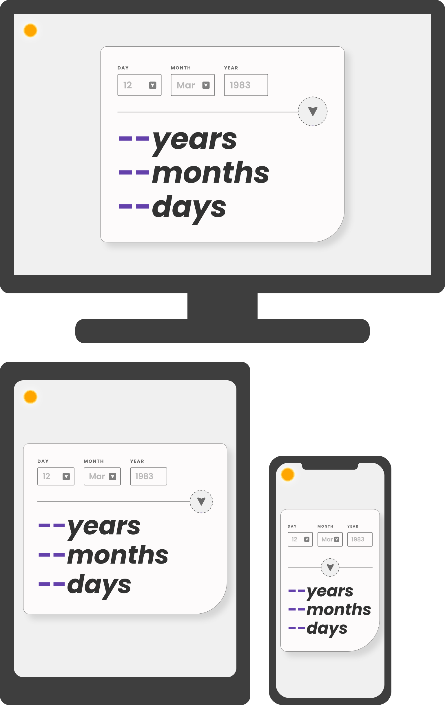
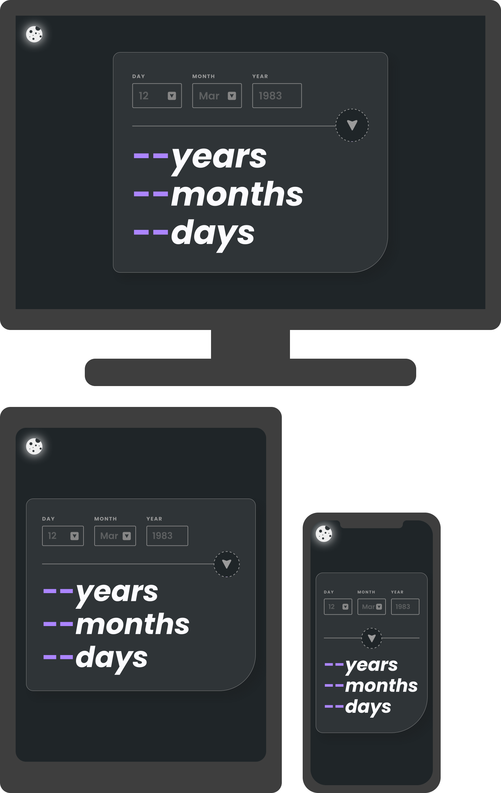
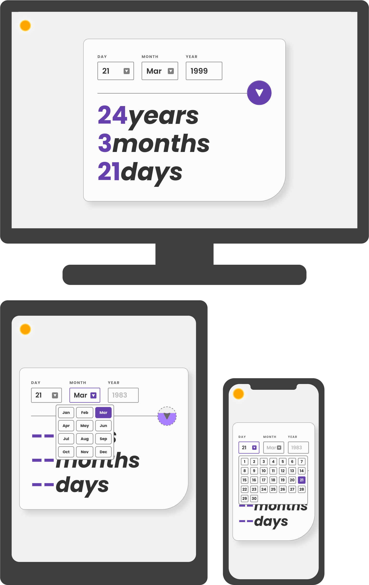
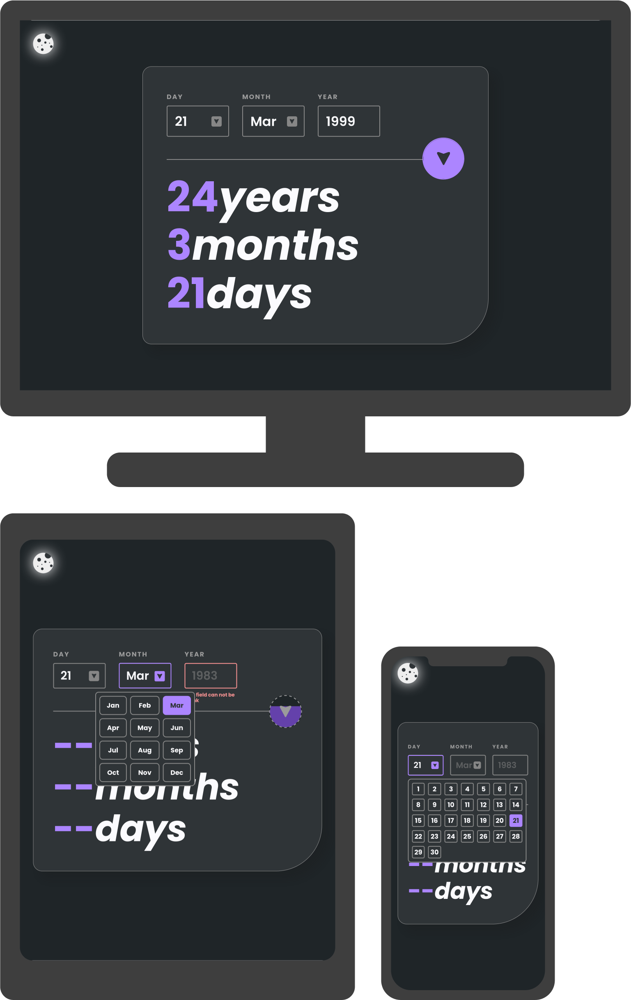
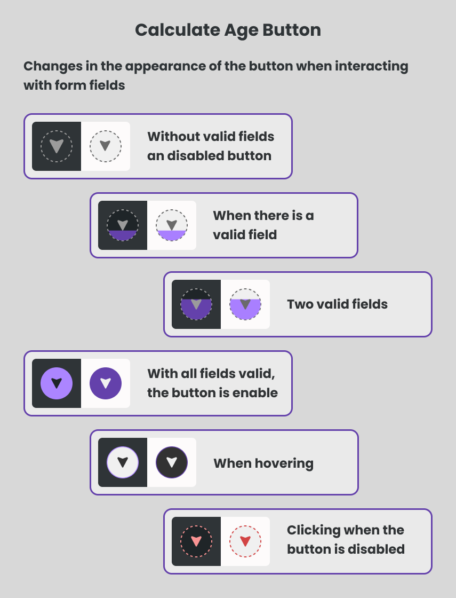
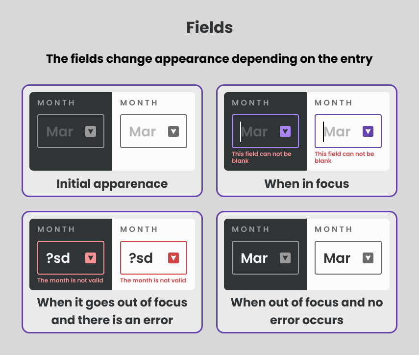

# Frontend Mentor - Age calculator app solution

This is a solution to the [Age calculator app challenge on Frontend Mentor](https://www.frontendmentor.io/challenges/age-calculator-app-dF9DFFpj-Q). Frontend Mentor challenges help you improve your coding skills by building realistic projects. 

## Table of contents

- [Overview](#overview)
  - [The challenge](#the-challenge)
  - [Screenshot](#screenshot)
  - [Links](#links)
- [My process](#my-process)
  - [Built with](#built-with)
  - [What I learned](#what-i-learned)
  - [Continued development](#continued-development)
  - [Useful resources](#useful-resources)
- [Author](#author)

## Overview

### The challenge

Users should be able to:

- View an age in years, months, and days after submitting a valid date through the form
- Receive validation errors if:
  - Any field is empty when the form is submitted
  - The day number is not between 1-31
  - The month is a number
  - The month is different to abrevition jan, feb, mar, apr, may, jun, jul, aug, sep, oct, nov or, dec
  - The year is in the future
  - The date is invalid e.g. 31/04/1991 (there are 30 days in April)
- View the optimal layout for the interface depending on their device's screen size
- See hover and focus states for all interactive elements on the page
- **Bonus**
  - Dynamic animation of calculate age button when fields are valid or invalid
  - Custom text field with a button that opens a pop-up window to select the values taken by the input text field
  - Button to change the page theme (dark and light)

### Screenshot
#### Initial state of application of the challenge view on mobile, tablet and desktop devices with light theme

#### Initial state of application of the challenge view on mobile, tablet and desktop devices with dark theme

#### Solution of the challenge view on mobile, tablet and desktop devices with light theme

#### Solution of the challenge view on mobile, tablet and desktop devices with dark theme

#### Button calculate age states

#### Field states

### Links

- [Solution URL](https://github.com/Alejandro25AR/Age-Calulator-React)
- [Live Site URL](https://alejandro25ar.github.io/Age-Calulator-React/)

## My process

### Built with

- Semantic HTML5 markup
- CSS custom properties
- Flexbox
- [Sass](https://sass-lang.com/) - CSS preprocessor
- Mobile-first workflow
- [React](https://reactjs.org/) - JS library
- BEMIT and Atomic design

### What I learned

- Optimizing an application with memo, useMemo and useCallback hooks
- Develop an application with atomic desing
- Organizing a project with clean architecture
- Develop an application with TypeScript
  - Types generics
- Use sass preprocessor mixins to separate tablet and desktop responsive design

### Continued development

- Optimizing an application with memo, useMemo and useCallback hooks
- Organizing a project with clean architecture and the best practice
- Use typescript to avoid errors and keep code cleaner

### Useful resources

- Latte And Code [Typescript y Genéricos #typescript](https://www.youtube.com/watch?v=Mtb7k35FSgE) - TypeScript and React library
- Youtube Channel [Gentleman Programming](https://www.youtube.com/@GentlemanProgramming/videos) - to learn clean architecture and new technologies
- [Hook to detect if a user clicked outside an element](https://blog.nahuel.dev/hook-para-detectar-si-un-usuario-hizo-click-afuera-de-un-elemento)

## Author

- Frontend Mentor - [@Alejandro25AR](https://www.frontendmentor.io/profile/Alejandro25AR)
- Linkedin - [Alejandro Rodriguez Avellaneda](https://www.linkedin.com/in/alejandro-ra-dev/)
